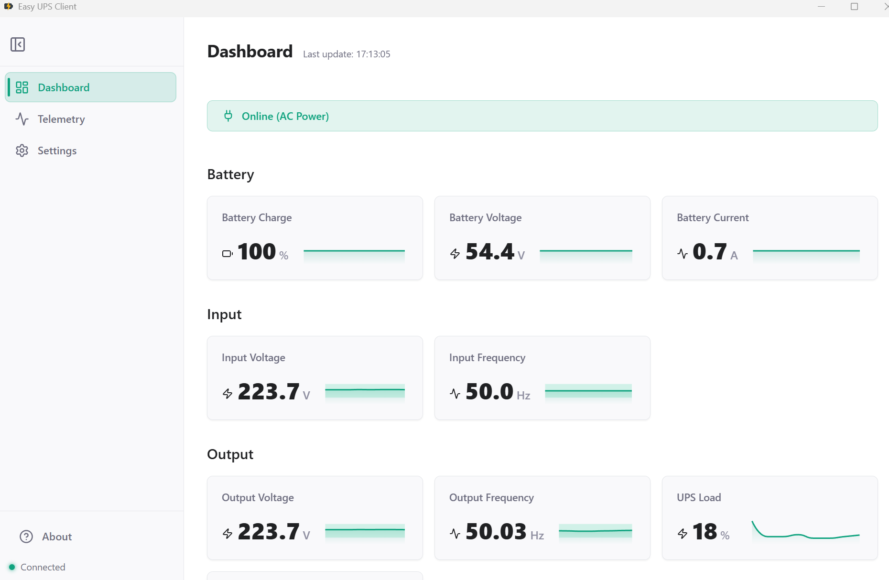

# Easy UPS Client



A modern desktop application for monitoring UPS systems via the NUT (Network UPS Tools) protocol. For now it focuses on SNMP UPS devices using nut, and also brings modern UI with standard warning and auto shutdown features. 

## Key Features

- **Real-time Monitoring**: Track voltage, load, battery level, and other critical UPS telemetry.
- **Visualized Data**: Sparkline charts for historical telemetry trends using eCharts and DuckDB.
- **Configurable Shutdowns**: Set custom countdowns for system shutdown during power failure events.
- **Multi-language Support**: Internationalization support via i18next.
- **Modern UI**: Clean, responsive design built with Tailwind CSS and Lucide icons.
- **System Icon Tray**: Minimizes to system tray with updated battery icons.
- **Configurable Warning/Auto Shutdown**: Automatic system shutdown/Full Screen Warning when battery levels become critical.
- **Basic NUT for Windows Configuration Helper**: Helps users set up a local NUT instance on Windows to monitor SNMP UPS devices, including writing configuration files and starting necessary services.

## Technology Stack

- **Framework**: [Electron](https://www.electronjs.org/)
- **Frontend**: [React](https://reactjs.org/)
- **Build Tool**: [Vite](https://vitejs.dev/)
- **Styling**: [Tailwind CSS](https://tailwindcss.com/)
- **Icons**: [Lucide React](https://lucide.dev/)
- **I18n**: [i18next](https://www.i18next.com/)
- **Database**: [DuckDB](https://duckdb.org/) (for telemetry storage)

## Getting Started

### Prerequisites

- [Node.js](https://nodejs.org/) (LTS recommended)
- [npm](https://www.npmjs.com/)

> [!IMPORTANT]
> **Manual NUT Configuration Required**
> NUT (Network UPS Tools) must be configured manually on the host system (or a remote server) before this client can connect to it. Ensure that the `upsd` service is running and accessible.
> A built-in "Configure NUT for Windows" flow is partially available and still under active development.

### Installation

1. Clone the repository:
   ```bash
   git clone https://github.com/lsy39/electron_ups_easy_client.git
   cd electron_ups_easy_client
   ```

2. Install dependencies:
   ```bash
   npm install
   ```


### Development

Start the application in development mode:
```bash
npm start
```

## Building & Packaging

To package the application for your current platform:
```bash
npm run package
```

To create a Windows NSIS installer (`out/nsis/*.exe`):
```bash
npm run make
```

To run the two steps manually:
```bash
npm run package:win
npm run make:nsis
```

To use Electron Forge's default makers (zip/deb/rpm):
```bash
npm run make:forge
```

## Configuration

The application stores settings locally using `electron-store`. You can reset all settings on startup by running:
```bash
npm run start:reset-settings
```

## TODO List

- [ ] Maybe native integration with NUT on windows?

## License

This project is licensed under the MIT License - see the [package.json](package.json) file for details.

## Author

**MystDove** - [admin@iloli.ch](mailto:admin@iloli.ch)
