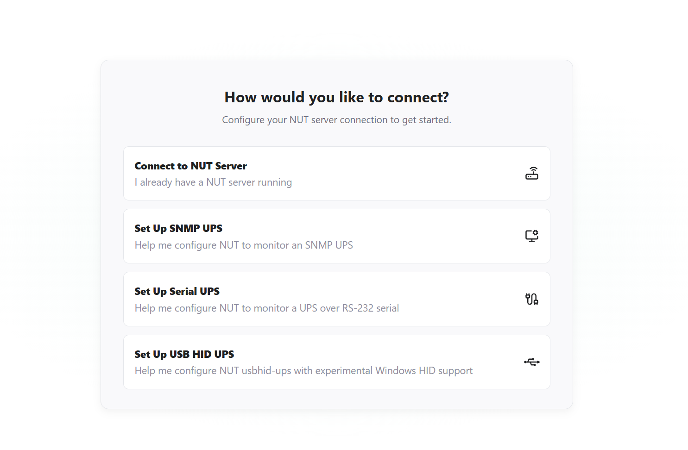
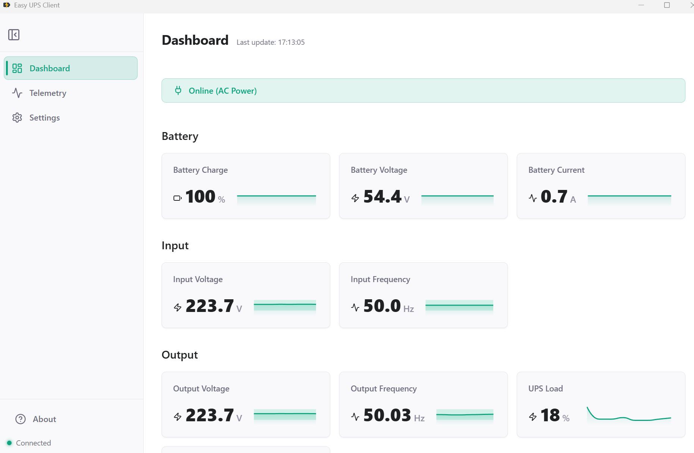

# Easy UPS Client




Easy UPS Client is a desktop app that helps you connect your UPS to NUT without digging through config files by hand.

It is designed to be friendly for normal users: the built-in setup wizard walks you through the important steps, and the app now fully manages the lifecycle of the local NUT processes it uses.

## Key Features

- **Easy setup wizard**: Helps you configure NUT step by step instead of editing everything manually.
- **Automatic NUT process handling**: Starts, stops, retries, and cleans up managed NUT processes for you.
- **Clear UPS monitoring**: Shows battery, load, voltage, frequency, and other live UPS values in a simple interface.
- **Helpful safety features**: Includes warnings, shutdown actions, tray behavior, and telemetry history.

## Why the Wizard Matters

Setting up NUT can be confusing if you are not familiar with drivers, ports, folders, and config files.

The wizard is meant to make that easier:

- It helps you choose the right setup mode.
- It prepares the local NUT setup for you.
- It checks the connection before you finish.
- It guides you back into setup later if you need to change something.

When the app manages a local NUT installation, it also handles the related process lifecycle for you. That means it can stop managed driver and `upsd` processes before reconfiguration, then bring monitoring back when setup is complete.

## Technology Stack

- **Framework**: [Electron](https://www.electronjs.org/)
- **Frontend**: [React](https://reactjs.org/)
- **Build Tool**: [Vite](https://vitejs.dev/)
- **Styling**: [Tailwind CSS](https://tailwindcss.com/)
- **Icons**: [Lucide React](https://lucide.dev/)
- **I18n**: [i18next](https://www.i18next.com/)
- **Database**: [DuckDB](https://duckdb.org/) (for telemetry storage)

## Getting Started

### Prerequisites

- [Node.js](https://nodejs.org/) (LTS recommended)
- [npm](https://www.npmjs.com/)

### Installation

1. Clone the repository:
   ```bash
   git clone https://github.com/lsy39/electron_ups_easy_client.git
   cd electron_ups_easy_client
   ```

2. Install dependencies:
   ```bash
   npm install
   ```


### Development

Start the application in development mode:
```bash
npm start
```

## Building & Packaging

To package the application for your current platform:
```bash
npm run package
```

To create a Windows NSIS installer (`out/nsis/*.exe`):
```bash
npm run make
```

To run the two steps manually:
```bash
npm run package:win
npm run make:nsis
```

To use Electron Forge's default makers (zip/deb/rpm):
```bash
npm run make:forge
```

## Configuration

The application stores settings locally using `electron-store`. You can reset all settings on startup by running:
```bash
npm run start:reset-settings
```

## TODO List

- [ ] Maybe native integration with NUT on windows?

## License

This project is licensed under the MIT License - see the [package.json](package.json) file for details.

## Author

**MystDove** - [admin@iloli.ch](mailto:admin@iloli.ch)
